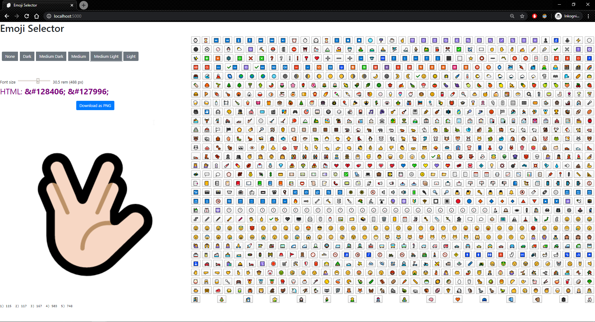

# Emoji Selector
Download the emoji to PNG format.

Source for Emojis: https://www.w3schools.com/charsets/ref_emoji.asp

Clone the repo.

```bash
npm install
npm run dev
```

### screenshots

use "Download as PNG" to export the emoji.


